#   Python

-   Try to implement: `import this`

###  Dtypes:
-   String:                 x = "hi"
-   Int                     x = 5
-   Float                   x = 5.5
-   List                    x = [1,2,3,3]
-   Dictonary               x = {1:3,"name": "Tomato"}
-   Set                     x = {1,2,3}
-   NoneType                x = None


### is vs ==
-   'is' operator returns true if two objects are referencing to same memory location.
-   '==' operator returns true if two objects are same based on their values.

    ```
        a = 3
        b = 3

        id(a) is equal to id(b) 
        then 
        a is b      <- returns True

        a = [1,2,3]
        b = [1,2,3]

        here id(a) is not equal to id(b)

        a == b      <- returns True
        a is b      <- returns False
    ```

### Behaviour of ++ and -- in python
-   ++ and -- is not treated as increment or decrement operators in python as it does in C++.

-   In python ++ and -- is treated as:
    ```
        a = 7
        ++a  =>  +(+a)  =>  +a
        --a  =>  -(-a)  =>  +a


        7 +++++ ++ + + a  =>    7+a         =>  14
        7 -- a            =>    7 + 7       =>  14
        7 --- a           =>    7 - (+7)    =>  7 - 7  => 0
        7 --- -- - - - a  =>    7 + 7       =>  14
    ```

### Module vs Package
-   Module:
    -   Module is a single python file having `.py` extension and can be imported and used in other files.
    -   Modules generally contains functions and classes which can be imported and used from any python file.
-   Package:
    -   Package is a directory which contain `__init__.py` file and multiple modules within it.
    -   This `__init__.py` file can be empty or can contain any initialization code for the package.
    -   Package can be imported as a single unit.

### Python Functions
-   reversed(): Take any iterable and reversed it and returns the iterator for this reveresed object.

    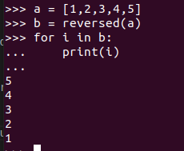

-   zip(): It is used to combine multiple iterables into a single common iterable. It combines corresponding elements of multiple iterables into a tuple and thus form a new iterable. In case of uneven length of iterables zip() form tuples till shortest iterable.
    ```
        a = ['Virat', 'Dhoni', 'Rohit', 'Shikhar', 'Jassi']
        b = [18, 7, 45]

        for i in zip(a, b):
            print(i)

        Output: ('Virat', 18), ('Dhoni', 7), ('Rohit', 45)
    ```
    -   intertools.zip_longest(a,b): works same as zip but forms tuples until the longest iterable gets exhausted, it fills None value in iterable already gets exhausted or iterated.

-   max(objects of similar types, key, default): It only compares similar objects or if key is set then returns max value according to the return value of key.
    ```
        a = [12, 'hello', {1,3,6,7}]
        b = [12, 'hello', {1,3,6,7}, 44, 576]
        max(a,b, key=len)

        Outputs: [12, 'hello', {1, 3, 6, 7}, 44, 576]
    ```
    -   min() also works in similar way just returning the minimum value.

-   sum(iterable containing int values): Returns sum of all elements in an iterable.

-   filter(function, sequence): Function took a single element as argument and returns True if it should be considered otherwise return False. Based on this function filter() method returns an iterator of the filtered data.


### False Values:
-   False
-   None
-   Zero of any numeric type
-   Any empty collection '', [], (), {}


### List
-   Can be declared as:
    -   x = []
    -   x = list(any iterable)
    -   Using dictonary to create list:  
        ```
            # Can use any iterables to create list   
            b = {1: 4, 2: 6}
            a = list(b)         # When we pass the dictonary object by default it will consider b.keys() 
            print(a)    ->      [1, 2]
            a = list(b.items())
            a = list(b.values())
        ```
-   When a list object is created a base memory address is assigned to it. Which can grow and shrink in contiguous memory blocks starting from the base address.
-    If you pop or remove the element all elements will shift towards right side to fill the empty block and last block is released.
-   Properties:
    -   Can contain heterogeneous data
    -   Lists are mutable in Python
    -   Dynamic size as vectors in CPP
    -   Stores references in contiguous memory locations of the data inserted.
        ```
        #0      #1      #2
        #12     #23     #34


        #12         #23                                 #34
        "Yashu"     ["Maths", "Computer Science"]       1
        ```

-   List Methods:
    -   append(element):    Append element to last of the list
    -   extend(iterable):   Extends the original list by appending the elements of the given iterable.
    -   insert(index, element): Append the given element at specified index.

    -   remove(single-object):  Removes the first occurence of the specified object from the list
    -   pop(index = (default)-1):   Removes the element from specified index of a list and returns it, the default index is -1.
    -   index(element, start(optional), end (optional)):    It returns the lowest index of the given element, we can specify the start index and end index for searching. It will throw value error if element is not in the list
    -   reverse():  reverses the original list
    -   sort(): Sort the entire original list 
    -   clear():    Removes all the elements from the list
    -   count(element):    It counts the number of occurence of given element with time complexity of O(n)

-   List Slicing:
    -   list_name[start : end : step]
    -   start: Starting index (inclusive), default is 0.
    -   end: Last index (exclusive), default is (len(list_name) - 1)
    -   step: Specifies interval between two considered elements, default is 1.

### Tuples
-   Properties:
    -   Immutable
    -   Hashable - Tuples can be the key in dictonary and values in set if all elements are also hashable.


### Dictonary
-   Can be declared as:
    -   x = {}      ->      type(x)     ->      type='dict'
    -   x = dict()  
    -   x = dict(k1:"v1", k2:"v2", k3:"v3")     ->  Declaring and initializing the dictonary with specified values.

-   Properties:
    -   Stores a key value pair
    -   It internally uses hashing and apply quadratic probation when collision occurs that is search for the empty slot to store key.
    -   Storage, Update and Retrival: Time complexity - O(1)

-   Dictonary methods:
    -   x.keys()    ->  Returns a list of keys : ['k1', 'k2', 'k3']
    -   x.values()  ->  Returns a list of values: ['v1', 'v2', 'v3']
    -   x.items()   ->  Returns a list of tuple : [('k1', 'v1'), ('k2', 'v2'), ('k3', 'v3')]
    -   x.pop(key, default-msg)  ->  Returns value corresponding to given key if not present returns default-msg. 
    -   clear():    ->      Empties the entire dictonary, takes O(n) time 
    -   copy():     ->      Returns the copies of the dictonary
    -   popitem()   ->      Returns (key, value)

-   Traversing through the dictonary:
    -   ```
            for key in x.keys():
                print("Key is: ", key, " ", " Value is: ", x[key])

            for (key, val) in x.items():
                print("Key is: ", key, " ", " Value is: ", val)
        ```


### Ordered Dictonary from collections
-   It has all properties of dictonary in addition to one quality of preserving the insertion order of elements.
-   If you change the value of any key, there will be no change in its position.

```
    from collections import OrderedDict

    od1= OrderedDict([(3: "Three"), (2: "Two"), (1: "One")])

    od2 = OrderedDict()
    od2[1] = "T-One"
    od2[3] = "T-Three"
    od2[2] = "T-Two"

    print(od1 == od2)   =>  Output: False
```

-   Reverse the order of OrderedDict:
    ```
        od1 = OrderedDict(reversed(list(od1.items())))
    ```

-   popitem(last=True)   =>  remove the last (key-value) and returns it. Or specify an index to remove specific item.


### Functions
-   Functions are the block of statements which will executed when called.
-   Instead of writting a code again and again we declare function to reuse it.

-   Parameters: The values that a function expect as declared in its definetion are called parameters (params).
-   Arguments: The actual values passed to functions when called are called arguments.

-   #### Docstring
    -   We can show information about the function in Docstring.
    -   Docstring will be highlighted when hover over function name
    ```
        def sayHello():
            """
            This function will print hello when called.
            """

            print('Hello')
    ```

-   #### Type-Hint:  
    -   A data type is specified as a hint which is just for understanding purpose.
    -   It is totally ignored by the python interpreter and will not be executed.
    -   You can specify type-hint using ':' operator
    ```
        a: int = 5
        b: str = 'String is there.'

        def func(name: str, age: int) -> int:
            print(name, age, sep='\n')
            return 0

    ``` 
    -   We can use <b>mypy</b> for static type checking in python:
        ```
            #Install
            pip install mypy

            #Static type checking
            mypy myfile.py
        ```
        -   The mypy will check the type hints and give error message if any, these error messages are just showing type errors as per type-hints.
        -   Our program will run even if the mypy has showed error messages as type-hints are just like comments when interpreted by python interpreter.

-   Python supports 4 types of arguments:
    -   Default arguments:
        -   Rule: There should be no any non-default argument followed by default argument.
        ```
            def func(a, b=10):
                print(a,b)


            func(5,5)   =>  output: 5 5
            func(5)     =>  output: 5 10
        ```

    -   Keyword arguments:
        -   Arguments passed with parametric names
        -   Used when order of parameters are not known.
        ```
            def func(fname, lname):
                print("Fname: ", fname," Lname: ", lname)

            func(lname='Ranparia', fname='Yashu')   =>  Output: Yashu Ranparia
        ```

    -   Positional arguments:
        -   When values are passed without parametric names they are considered as positional arguments.
        ```
            def func(fname, lname):
                print("Fname: ", fname," Lname: ", lname)

            func('Yashu', 'Ranparia')   =>  Output: Yashu Ranparia
        ```

    -   Arbitary arguments:
        -   We can pass a variable number of arguments while calling a function.
        ```
            def func(*args):
                for arg in args:
                    print(arg,end=' ')

            func('Yashu', 'Ranparia')   =>  Output: Yashu Ranparia


            def func(**kwargs):
                print(kwargs)

            func(name="Yashu", cmp="Simform")   =>  Output: {name: "Yashu", cmp: "Simform"}
        ```

### Pass Keyword
-   Pass indicates that the line must not be executed by the interpreter


### Packing and Unpacking
-   Here * and ** is used  for packing and unpacking tuples and dictonary respectively.
-   A * operator is used for sequence and ** is used for key-value pairs

-   Packing: When we do not know how many arguments will be passed to function, we can use packing to pack any number of arguments into a single variable.
```
    def hobbies(*args);
        for hobby in args:
            print(hobby)

    hobbies("Cricket", "CP", "Automation")    <-   These arguments are packed as tuple named args 
```  


-   Unpacking: When a function expects a number of arguments (say 5) and I have already a list or a tuple of these arguments I can pass the unpacked list or tuple.
```
    def details(fname, lname, city, state, college):
        print('Anything')

    
    # I am getting user input as list
    user_detail = ["Yashu", "Ranparia", "Admedabad", "Gujarat", "CHARUSAT"]

    details(*user_details)  <-  Unpacking of a list
```

-   Unpacking a dictonary:
    ```
        def details(fname, lname, city, state, college):
            print(fname, lname, city, state, college, sep=' ')

        # I have user input as dictonary
        user_input = {"fname": "Yashu", "lname": "Ranparia", "city": "Ahmedabad", "State": "Gujarat", "college": "CHRUSAT"}

        details(*user_details)  =>  Output: fname lname city State college

        details(**user_details) =>  Output: Yashu Ranparia Ahmedabad Gujarat CHARUSAT
    ```

    -   ** will pass the values of the dictonary.
    -   A * will only pass the keys of dictonary.

-   *args expects comma seperated objects
-   **kwargs used specifically for named arguments, where it packs the named arguments in form of key:value pair i.e. dictonary.

-   **kwargs usage: <! Passed Arguments must be named !>
    ```
        def details(**kwargs):
            for key,value in kwargs.items():
                print(key, ' ', value)


        details(name="Yashu", cmp="Simform", hobbies=["Cricket", "CP", "Automation"])
    ```

### Print function 
```
    print("Hello", "Yashu", sep=" ", end=". ", file = sys.stdout (default), flush = False (default))
    print("How are you?")
    Output: Hello Yashu. How are you?
```
-   Objects: Strings or other objects passed as arguments to display as output.
-   sep:    The specified string will used to seperate the given objects.
-   end:    The print statement will end with the specified string in end.
-   file:   Print statement outputs by default in sys.stdout that is system console. But if we specify the file object in writing mode it will output it in to specified file.
-   flush:  By default false, if True it immediately flushes the buffer.

-   Buffering & Flushing:
    -   Print() will push the output string to buffer.
    -   The buffer will flush when:
        -   Buffer is full
        -   Newline ('\n') is encountered
        -   program ends
        -   flush = true


### Decorators
-   Decorators provides a way to add extra functionalities to functions with altering them.
-   Decorators are the functions which takes other function as argument and returns a wrapper function which have implemented something before and after call of original function thus adding extra functionalities to original function.

[Decorators](decorator.py)

```
def decorator_function(original_function):
    def wrapper_function(*args):   
        print('Before!')
        ans = original_function(*args)
        print('Sum is: ', ans)
        print('After!')

    return wrapper_function


@decorator_function
def add(*args):
    print('Adding values!')
    ans = 0
    for x in args:
        ans = ans + x
        pass

    return ans


add(2,3,4,5)
```

### Iterators and Generators
-   Iterators: Used to iterate over an iterable objects. 
    -   Follows lazy execution
    -   Uses a single block of memory to access the value of element.
    -   `__iter__()` method returns an iterator, `__next__()` it returns the next value and also make iterator points to this next value.
    -   Implemented using class

-   Generators: Used to generate the space optimized iterable
    -   Follows lazy execution
    -   Implemented using functions
    -   Uses yield to temporary stop execution and return value until control returns back to it.
    -   yield returns an iterator, thus every generator is an iterator.

### Garbage collection
-   Python has a support for inbuilt garbage collection using reference counter and cyclic garbage collector
-   reference counter: Maintains the records for number of refernces for a particular variable, if it is 0 then it release out the memory space for that variable
-   del operator in python:
    -   del {specify-object}
    ```
    a = "Yashu"
    del a

    It remove all the references to a and free up the memory.
    ```


### Standard Libraries
-   Libraries provided by the python itself as builtin support.

    #### math
    -   Provides all mathematical functions

    #### webbrowser
    -   Provides functions to interact with browsers.
    -   Can go on a specific URl, open new window of browser, etc.

    -   And many more ...

### OOP in Python
-   Class:  A relatable object which has its own characteristics (attributes) and behaviour (Methods).

-   In programming a class declaration is just a blueprint for an object instance.

-   Attributes: Variables associated with the class are known as attributes.
-   Methods: Functions associated with the class are known as methods.

-   Class Variable and Instance Variable
    -   Class Variables:    Variables declared outside the methods of the class and shared among all the instances of the class.
    -   Instance Variable:  Variables declared within methods or using self param are Instance Variables. Each instance has its own copy of these variables.

    ```
        class Employee:
            emp_num = 0     #Class Variable | Shared among all instances

            def __init__(self, fname):
                self.fname = fname      #Instance Variable
                self.salary = salary    #Instance Variable
                self.initLeaves()

            def initLeaves(self):
                self.leaves = 0     #Instance Variable
    ```

    -   Class variables can be accessed as:
    ```
        Employee.emp_num = 5    #willl change the value for all instances
    ```

-   A standard and right way to use Class Variables?
    -   We can access the class variables using class name and instance.
    -   As far as just retrival of class variable is concerned we can do it with instance of class.
    -   For UPDATE, always use CLASS_NAME.class_variable
    -   If we try to UPDATE using instance.class_variable, it will be a re-assignment operation and thus a new variable with same name as class_variable name is generated in namespace of that instance.
    -   
        ```
            class A:
                v = [1222]

                def update(self, x):
                    A.v = x
                    #!WARNING : self.v = x  Again a re-assignment operation will create a new varaible in instance namespace

            o1 = A()
            o2 = A()
            print(f'Memory address of o1.v {id(o1.v)}')
            print(f'Memory address of o2.v before re-assignment {id(o2.v)}')
            o2.v = [1222]
            print(f'Memory address of o2.v after re-assignment {id(o2.v)}')
            print(f'Memory address of A.v {id(A.v)}')
        ```
        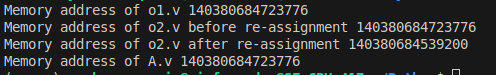

-   Example: 
```

class Employee:     #Declaration of Class named Employee
    
    #Class Variables/Attribute
    emp_num = 0

    #constructor or init method
    def __init__(self, fname, lname, salary, joining_date):
        
        # Attributes
        self.fname = fname
        self.lname = lname
        self.salary = salary
        self.joining_date = joining_date
        pass


    # Methods
    def get_full_name(self):
        return self.fname + ' ' + self.lname
    
```

-   #### Instance-Methods | Class-Methods | Static-Methods
    -   <b>Instance methods</b>: The normal methods of the class where an instance reference is passed when any instance try to access it.  

    -   <b>Class-Methods</b>: The methods declared using @classmethod decorator and it takes class as param instead of instance reference. You can call it using any insatnce but still a class is passed as param not an instance reference.
        -   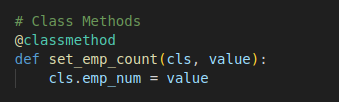
        -   Classmethod as an alternate constructor:
            -   Classmethods can be used as alternate constructor when you want to initiallize an object with some different format of argumetns than original constructor.
            -   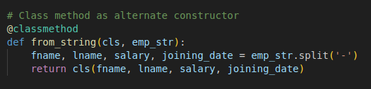
                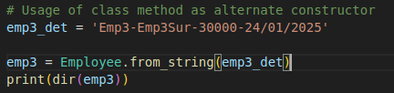


    -   <b>Static Methods</b>: The methods which do not require and use instance reference or class reference are called static methods.
        -   Static methods do not know the state of class and also can not change the state of class, they are just present inside the class because they have some logical connection with the class.
        -   We can access static methods using class name or instance.
        -   
            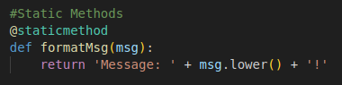


-   <b>Remember</b>: When any insatnce tries to access the class variable or any methods interpreter tries to look it in instance's namespace first, then if not found it goes to its ancestors namespace. It is called Method Resolution Order (MRO).


### Operator Overloading or Magic Methods Overriding

-   #### Dunder - Double Underscore
    -   Dunder stands for Double Underscore in Python
    -   It referes to special methods declared with double underscore at the beginning and end of the name of methods also known as <b>Magic Methods</b>.  
    -   Usually these methods are declared to invoke impliitly by the python at certain situations.
    -   Examples:
        -   \__add__() method is called when we do (a + b).
        -   \__len__() method is called when we do len(xyz)
```
class Equipment:
    __total_eqip = 0
    def __init__(self,name,quantity,price):
        self.name = name
        self.quantity = quantity
        self.price = price
        pass

    def get_details(self):
        print(self.name, self.quantity,sep=' ')


    #Operator Overloading or Magic Methods Overriding
    def __add__(self, other):
        return (self.price * self.quantity + other.price * other.quantity)

    def __len__(self):
        return self.quantity


hammer = Equipment("Hammer", 5, 120)
screw = Equipment("Screw", 50, 5)

print('Total Price: ', (hammer + screw))

print('Total Quantity: ', len(hammer))

```

Output:

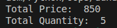


### Inheritence
-   A class inherit the attributes and methods from another class.

-   <b>Method Resolution Order</b>:
    -   When we try to access the attributes or methods using class name or using instances the python interpreter first tries to find it in the namespace of the calling reference.
    -   Python MRO uses C3 Linearization Algorithm
    -   It is very helpful to maintain the order of the methods specifically in multiple inheritance.
    -   Example:
    ```
        class A:
            def method(self):
                print('A',end='')


        class B(A):                 &       class C(A)
            def method(self):                   def method(self):
                print('B',end='')                          print('C',end='')
                super().method()                    super().method()

        class D(B, C):
            def method(self):
                print('D',end='')
                super().method()


        d = D()
        d.method()


        Output:
        D -> B -> C -> A

        When you do same in C++:
        Output: D -> B -> A -> C -> A

    ```

    - C3 Linearization Algorithm :
        -   Order is preserved as Left to Right
        -   Level order is preserved from child towards parent
    ```
            start -> D      (Level 0)

                   B    C   (order preserved as: Left to right) (Level 1)

                     A          (Level 2)
    ```


-   How to inherit:
    ```
        from oops import Employee

        class Developer(Employee):
            def __init__(self, *emp_Det, dept):
                super().__init__(*emp_Det)
                self.dept = dept
                pass

            def get_details(self):
                print('Name:', self.fname, self.lname,sep=' ',end='\n')
                print('Salary: ',self.salary)
                print('Joining date: ', self.joining_date)
    ```

-   We can use super method inside the subclass in order to access the parent class attributes and methods. 

-   super(): super method in python creates a temperory object which allows us to access all the attributes and methods of the super or parent class, like super().name_of_attr


#### Multiple Inheritance
-   A subclass with multiple parent classes.
-   ##### How to access the method of specific parent 
-   
    ```
        class A:
            def __init__(self, name):
                self.name = name
                pass

            def printD(self):
                print(self.name)


        class B(A):
            def __init__(self, surname):
                self.surname = surname
                pass

            def printD(self):
                print(self.surname)


        class C(A):
            def __init__(self, home):
                self.home = home
                pass

            def printD(self):
                print(self.home)


        class D(B,C):
            def __init__(self, **details):
                self.contact = details['contact']
                B.__init__(self, details['surname'])
                C.__init__(self, details['home'])
                A.__init__(self, details['name'])
                pass

            def printD(self):
                #2 ways to access the methods of parents in multiple inheritance.
                B.printD(self)
                super(B,self).printD()  #Calls the method of class C not B
                A.printD(self)
                print(self.contact)


        objD = D(name="Yashu", surname='Ranparia', home='Junagadh', contact='1234567890')
        objD.printD()
    ```
-   2 ways:
    -   super(B,self).printD()  # Interpreter will look for method just after the specified reference
    -   B.printD(self)      #Directly calls printD method of class B

-   #### Abstract Class and Abstract Methods
    -   We can declare the class as abstract using ABC class from abc module
    -   Abstract Class: Class inherited using ABC class and must have at least one abstract method.
    -   Abstract Method: Method with decorator @abstractmethod and has just pass statement in body are abstarct methods. 
        -   In python @abstractmethod mentioned for a method tells interpreter that the method must be implemented by the subclass.
        -   In python if we have mentioned @abstractmethod and stil  providing some implementation to the method it will run without any error.

    ```
    from abc import ABC, abstractmethod

    class TheThread(ABC):

        @abstractmethod 
        def run():      #Remember: If you mention implementation still it will be an abstract method
            pass

    obj = TheThread()
    ```
    - Produce an error:
    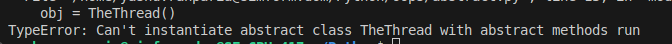


### File Handling
-   Opening a file:
    ```
        f = open('test.txt')
    ```

-   #### Context Manager (with - statement)
    -   <b>with</b> provides a resource management by creating a context for specific resource access.
    -   'with' creates a context for accessing any recource say for I/O operations.
    -   It call '\__enter__' method which do the job of acquiring the lock and possession over resource to get accessed and it can return the value as object to perform operation over the accessed resource (here file).
    -   At the end of the context block it calls the '\__exit__' method which takes arguments (exception_type, exception_value, traceback), if any exception occurs in the execution block these values will be passed to '\__exit__' method which will show up the exception message.
    -   '\__exit__' method does the job of releasing the lock over resources and end the context of resource. It closes the files, so we do not need to handle all these explicitly.
    -   
        ```
            with open('test.txt','w') as f:
                print(f.name)
        ```
        -   #### What 'with' will do here
            -   It calls the f.\__enter__() method first and f.\__exit__() at last.
            -   Thus we can only use the object which has a support for context management protocol which have theses implemented methods {\__enter__ and \__exit__} 
            -   That's why the below code will not work.
                ```
                    a = 5

                    with a:
                        print('Hello')
                ```


    -   Custom Context Manager:
        ```

            class MyContextManager:
                def __enter__(self):
                    print('Entering the context block.')
                    return self
                
                def __exit__(self, exc_type, exc_value, traceback):
                    print('Closing the context.')

            with MyContextManager():
                print('Accessing the resources.')
        ```
        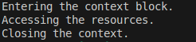

-   Opening file with context manager:
    ```
        with open('test.txt') as f:
            print(f.name)
    ```

-   Modes of opening a file:
    -   r: read a file, raise error if file does not exist
    -   r+: read and write to a file, raise error if file does not exist
    -   rb and rb+: specifically for binary data
    -   w: write to a file, creates a file if it does not exist
    -   w+: write and read a file, creates a file if it does not exist
    -   wb and wb+: specifically for binary data
    -   a: append to a file, creates a file if it does not exist
    -   a+: append and read a file, creates a file if it does not exist
    -   ab and ab+: specifically for binary data
    -   x: Specifically to create a file, raise error if file already exist
    -   x+: Specifically to create a file with read and write mode, raise error if file already exist
    -   xb and xb+: specifically for binary data


-   Read data from file:
    ```
        with open('test.txt', 'r') as f:
            print(f.read(10)) <- Reads only 10 characters from file
            print(f.readline())     <-  Can specify the number of chars to read
            print(f.readlines())    <-  Can specify the number of characters to read take whole line if specified character limit permits 
            print(f.read())     <-  Reads entire data
    ```

-   Writing to a file:
    ```
        with open(file_path, 'w') as f:
            f.write('Warning! Do not delete.')
            f.writelines(['Do it as told to you.\n', 'Okay! I will do it.\n'])
    ```

-   Get the file pointer location:
    ```
        with open(file_path, 'a') as f:
            print(f.tell())     <-  Returns the location of the file pointer
    ```

-   Change the location of file pointer:
    ```
        with open(file_path, 'a') as f:
            print(f.seek(0))     <-  Moves the file pointer to beginning of the file
    ```
    ```


### Collections module
-   Collections module provides data structures or containers to store and retrive data with specific characteristics.

-   #### Counter
    -   It is a subclass of dict
    -   A data structure specifically made to store the count of occurences of elements in an iterable.
    -   
        ```
            from collections import Counter
            cntr = Counter([1,3,1,2,4,5,4,4])

            print(cntr.items())
            print(cntr.most_common(1))
            for i in cntr.elements():
                print(i)
        ```
        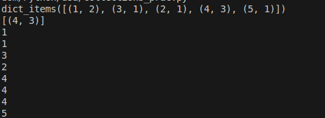

    
-   #### NamedTuple
    -   A subclass of tuple which has named field attributes.
    -   Immutable like tuple
    -   Initialize namedtuple(typename, field_names):
        ```
            Point = namedtuple('Point', ['x', 'y'])
            pt = Point(2,3)
            print(pt.x, pt.y)
        ```
    -   It provides both access from key-value and index, the functionality that dictonary lack.
    - Use case: When we need an immutable class like structure which can provide a way to access the values using names.


-   #### Ordered Dictonary
    -   It is a subclass of dict
    -   It differs from unordered dict by preserving the order of insertion of keys.
    -   If value of any key changes, order will not change.
    -   
        ```
            a = {1:1, 2:2}
            c = {2:2, 1:1}

            from collections import OrderedDict
            b = OrderedDict()
            d = OrderedDict()
            b[2] = 2
            b[1] = 1

            d[1] = 1
            d[2] = 2

            print(a == c)
            print(b == d)
        ```
        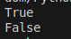

    -   provides a method called - popitem() which follow LIFO order by default and FIFO order if we set last = false.
    -   delete a key-value using pop(specific-key)

-   #### Deque
    -   Deque - A double ended queue
    -   Allows both LIFO and FIFO operations on a same data structure.
    -   Initialize:
        ```
        q = deque([1,2,3,4,5,6,7,8,9])

        q.append(10)
        q.appendleft(0)
        print(q)
        q.pop()
        q.popleft()
        print(q)
        q.extend([11,12,13])
        q.extendleft([-1,-2,-3])    # Extends the deque by adding the given iterable in reverse order
        print(q)
        ```
        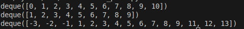

-   #### ChainMap
    -   It stores multiple dictonary into a container
    -   provides functions to get keys, values and key-value pairs for all dictonaries stored in it. 

-   #### Default Dictonary
    -   A subclass of dict
    -   It has a characteristic to initialize the dictonary with default value for keys using factory functions like (list, int, str).
    -   How to use:
        ```
            ddict = defaultdict(str)
            ddict[1] = 2
            ddict[2] = 'b'

            print(ddict)
            print(ddict[3])
        ```

### Asynchronous Programming
-   In depth:  [Async Programming in python](AsyncProgramming.md)
-   #### Subroutine VS Coroutines
    -   Subroutines:
        -   Subroutines: Are functions or procedures which can be called from anywhere in the program. When called the execution control goes to subroutine and when returns control goes back to program where the subroutine is called.
        -   Subroutines have single entry point and single exit point.
        -   Uses ```return``` to exit and return the value.
    -   Coroutine: 
        -   Are like functions which can suspend and resume whenever needed.
        -   They can return values and then resume where they left off by preserving the state.
        -   Used for Asynchronous programming mainly to avoid bloackage due to I/O operations.
        -   Uses ```yield```  to return with preserving the state. 

-   Coroutines are used to achieve asynchronous programming
-   coroutines can be defined using ```async``` keyword in function definiton which when called gets awaited using ```await``` keyword or include any awaited instruction.
    ```
        import asyncio
        async def add(val):
            a, b = val
            await asyncio.sleep(4)  #awaited instruction

            return a+b

        await add()
    ```

-   By just calling the function as add() will not work asynchronously, but we have to do:
    ```
    def main():
        task1 = asyncio.create_task(multiply(vals))
        task2 = asyncio.create_task(add(vals))
        await task1
        await task2
    
    asyncio.run(main())
    ```

-   Awaitable objects: 
    -   Objects which can be used with ```await``` keyword.
    -   3 objects :
        -   Coroutines: Defined using ```async def```
        -   Tasks: Are scheduled coroutines which added into event loop
        -   Futures: Objects which does not have the value yet but may get in future. Thus these objects may awaited to stop the coroutine execution until the future object gets its result.
            ```
                import asyncio

                async def set_future_result(future, result):
                    await asyncio.sleep(1)
                    future.set_result(result)

                async def main():
                    # Create a Future object
                    future = asyncio.Future()

                    # Schedule a coroutine to set the result of the Future
                    asyncio.create_task(set_future_result(future, "Hello, Future!"))

                    # Await the Future to get the result
                    result = await future
                    print(result)

                asyncio.run(main())
            ```
    -   Implementation: 


### Request Module
-   Used to make HTTP request and handle responses between client-server.
-   It supports all HTTP methods: [GET, POST, PUT, PATCH, DELETE, HEAD, OPTIONS] 
-   Refer HTTP methods here: 


### Singleton - Design Pattern
-   It  ensures that a class has only single instance throuout the whole program.
-   It provides global accessibility and thus has only one state throughout the program.
-   The class controls its instantiation process to guarente a single instance through out the program.
-   Here a dictonary is maintained as private variable in class which preserves the key-value pair as {class_name: instance}, if present return that instance only otherwise add a new instance.
-   Refer implementation: [Singleton](design_patterns/singleton.py)


### Monkey-Patching
-   Monkey patching is a way to modify behaviour of our code or functionality dyamically at runtime.
-   Example:
    ```
        class ScoobyDoo:
            def say(self):
                print('Hello')

        ScoobyDoo.say = lambda self: print('Scooby Dooo....')

        obj = ScoobyDoo()
        obj.say()   <-  Output: Scooby Dooo....
    ```