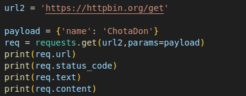
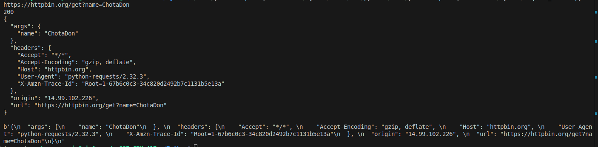
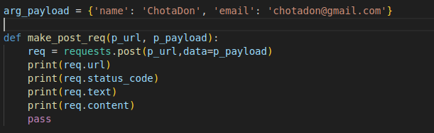
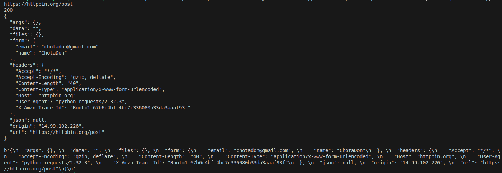

# HTTP Methods (Context: Python Request module)
-   HTTP is the simplest and most widely used data communication protocol.
-   It is used for fetching and sending data to servers.
-   There are many other protocols used for fetching and sending data like [FTP, SFTP, WebSOCKET, MQTT, SMTP, REST, SOAP] but among these HTTP is most widely used protocol.
-   The default port for HTTP is 80.
-   The server after processing the get request prepare and sent HTTP Response object.
-   <b>HTTP Response Object</b>:
    -   It has 3 main parts:
        -   Status Line: Includes HTTP version, Status Code, Reason Phrase.
        -   Header: Gives additional information like [encoding type, to connection keep-alive or not, etc.], in key-value pairs.
        -   Body: Actual requested data could be HTML page, XML, etc.

-   What are Query Parameter:
    -   Query params are key-value pairs need to send to server as additional information.
    -   We can sent query parameters in the url after '?' symbol. Example: `http://example.com/books?author=Shakespeare&title=Hamlet`
    -   Usage:
        -   Filtering and sorting of data
        -   pagination, specifing the specific location for a data
        -   State and session management, we can pass session id as query param
        -   specify actions for triggering 
    
-   Payload:
    -   Payload is a term used for the actual data that a client sent to server to create or update or to perform any specific operation at server side.

-   HTTP methods:
    -   GET: It is used to request data from a specified resources.
        -   Specifically used to request data.
        -   When a GET request is made server will first look in cache memory and if required data is not found then after it looks to database.
        -   Python `request` module also allows to pass the data as body to servers using GET methods but it is not a standard practice as some server may not support GET request to allow body with it.
        -   Request:
            

            Response:
            

    -   POST: It is used to send data to servers.
        -   The data is sent in body section of HTTP request object.
        -   The POST request can cause changes in the server as it is used for purposes of CREATE resources.
        -   Making post request server assigns the resource id as new resource is being created.
        -   Each POST call results into creation of new resource with a new identificatoin id assigned by the server.
        -   Request:
              

            Response:
            

    -   PUT: It is used to update data or create if it does not exist.
        -   It is idempotent (repeating the request will result same)
        -   Data is included in body of request
        -   Client will provide the resource ID which needs to be updated, if not exist it will create.

    -   DELETE: Used to delete a specified resource.
        -   It is idempotent.
        -   It is used to remove the resource from the server.
        -   The server will send the response which includes the status of deletion.

    -   PATCH: Used for partial modification of resource at server side.
        -   Only changes are included into the body of the request.
        -   Response will contain the updated resource.
        -   It is not idempotent

    -   HEAD: Similar to GET method but it does not return body of response, only returns header.
        -   Used to check what get method will return without actual data
        -   It is idempotent.

    -   OPTIONS: Used to describe the allowed HTTP methods by the target resource.
        -   The server will returns the allowed HTTP methods for the target resource which will be mentioned in `Allow` in header.
        -   It is idempotent.